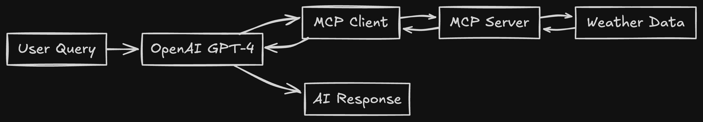

# Weather MCP Example - A Hands-On Learning Project

This repository contains my hands-on exploration of the **Model Context Protocol (MCP)** - a learning experiment to understand how MCP enables AI models to interact with external systems through a standardized protocol.

## 🎯 Learning Objectives

This project demonstrates:
- How MCP servers expose tools and resources to AI models
- Integration between MCP clients and OpenAI's GPT models
- Real-time communication over stdio transport
- Schema validation and tool calling workflows

## 🏗️ Project Structure

```
weather-mcp-app/
├── server/            # MCP server implementation
│   ├── src/
│   │   └── index.ts   # Main server with weather tools
│   └── package.json
├── client/            # MCP client application
│   ├── src/
│   │   └── client.ts  # OpenAI + MCP integration
│   └── package.json
└── README.md 
```

## 🚀 Quick Start

### Prerequisites

- **Node.js** v18 or higher
- **OpenAI API Key** (sign up at [platform.openai.com](https://platform.openai.com))

### 1. Clone and Setup

### 2. Setup & Run Server

```bash
cd server
npm install
npm run build
npm run dev
```

### 3. Setup & Run Client

```bash
cd ../client
npm install

# Create environment file with your OpenAI API key
echo "OPENAI_API_KEY=your_actual_api_key_here" > .env

npm run build
npm run dev
```

## 💬 Example Usage

Once running, try these queries:

```
> What's the weather in Aleppo?
> How's the weather in Istanbul today?
> Show me weather data for both supported cities
> What cities do you have weather data for?
```

## 🔧 How It Works

### MCP Server (`server/`)
- **Framework**: Model Context Protocol SDK
- **Transport**: Stdio (standard input/output)
- **Tools**: `getWeatherDataByCityName` - Returns mock weather data
- **Resources**: `weather://cities` - Lists supported cities
- **Validation**: Zod schemas for type safety

### MCP Client (`client/`)
- **Integration**: OpenAI GPT-4 + MCP Server
- **Flow**: User Input → GPT-4 → MCP Tools → Weather Data → Response
- **Transport**: Stdio client connecting to server process
- **Interface**: Interactive CLI using readline

### Communication Flow


## 📚 Key Learning Points

1. **MCP Protocol**: Standardized way for AI models to access external tools
2. **Tool Registration**: How servers expose callable functions to clients
3. **Resource Exposure**: Static data available to AI models
4. **Type Safety**: Zod schemas ensure proper input validation
5. **Transport Layer**: Stdio communication between processes
6. **AI Integration**: Converting MCP tools to OpenAI function calling format

## 📖 What I Learned

This hands-on project helped me understand:
- MCP's role in the AI ecosystem
- How tools and resources work differently
- The importance of schema validation
- Integration patterns between AI models and external systems
- The practical implementation of the MCP specification

## 📄 License

ISC - Feel free to use this learning example for your own MCP exploration!